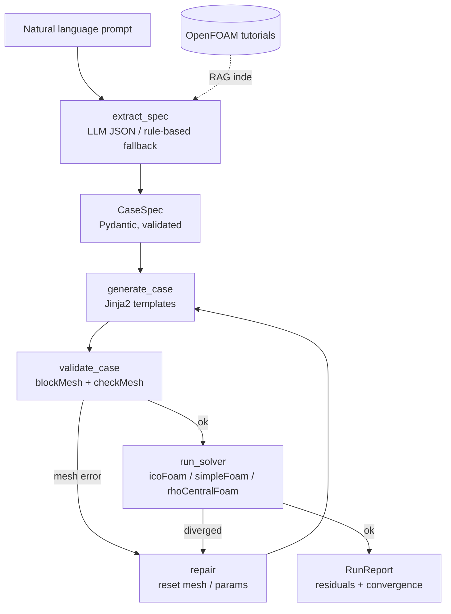

# CFD Case Copilot

**Turn a plain-English description of a flow problem into a validated, runnable
[OpenFOAM](https://www.openfoam.com/) case — meshed, quality-checked, solved, and
self-corrected, all driven by a local LLM agent.**

```
"Supersonic flow over a forward step at Mach 3, air at 300 K and 101325 Pa"
      │
      ▼  (qwen2.5-coder:7b extracts a structured spec — never raw OpenFOAM)
      ▼  (validated Jinja2 templates render the case)
      ▼  (blockMesh + checkMesh + rhoCentralFoam run; the agent reads the logs)
      ▼
runs/forward_step_mach3_0/   ✅ Mesh OK · solver reached End · ready for ParaView
```

Setting up an OpenFOAM case means hand-editing a dozen finicky dictionary files
across `system/`, `constant/`, and `0/`. This project automates that with an
agent that is **grounded in OpenFOAM itself** — it doesn't just guess, it meshes
and runs the case and reacts to the real solver output.

---

## Why this design works (and why naive LLM approaches fail)

> **The LLM never writes OpenFOAM syntax.**

A 7B local model cannot reliably emit valid `blockMeshDict` / `fvSchemes` syntax —
that's why "ask the LLM to write the whole case" approaches fall apart. Here the
responsibilities are split:

| Step | Who does it | Why it's reliable |
|------|-------------|-------------------|
| Understand the request | **LLM** → fills a small JSON schema (`CaseSpec`) | LLMs are good at structured extraction |
| Produce dictionary files | **Deterministic Jinja2 templates** derived from real OpenFOAM v2412 tutorials | Syntactically correct *by construction* |
| Decide if it's correct | **OpenFOAM** (`blockMesh`, `checkMesh`, the solver) | Ground truth, not a guess |
| Fix failures | **Agent loop** reacts to OpenFOAM's own error messages | Closed-loop, evidence-based |

Every generated template in this repo has been **executed end-to-end on OpenFOAM
v2412** (see the integration tests).

---

## Architecture



The agent loop is implemented twice from the same node functions: a plain,
dependency-free orchestrator (`run_pipeline`) and an equivalent **LangGraph**
`StateGraph` (`build_graph`).

---

## Supported cases

| Case type | Physics | Solver | Example prompt |
|-----------|---------|--------|----------------|
| `cavity` | Lid-driven cavity, laminar, incompressible | `icoFoam` | *"lid-driven cavity at 1 m/s, nu 0.01"* |
| `channel` | 2D channel/duct, turbulent (RANS), incompressible | `simpleFoam` | *"turbulent channel flow at 10 m/s, k-omega SST, Re 50000"* |
| `forward_step` | Supersonic flow over a step, compressible | `rhoCentralFoam` | *"supersonic flow over a forward step at Mach 3"* |

`channel` supports `kOmegaSST` and `kEpsilon`. `forward_step` derives velocity from
a Mach number using the ideal-gas speed of sound and auto-sizes the time step from
the CFL condition.

---

## Quickstart (WSL / Linux)

### 0. Prerequisites
- OpenFOAM (tested on **v2412**, ESI/openfoam.com build) — source its `etc/bashrc`.
- [Ollama](https://ollama.com/) with the local models (optional — a rule-based
  parser works without it):
  ```bash
  ollama pull qwen2.5-coder:7b
  ollama pull nomic-embed-text
  ```

### 1. Install
```bash
git clone https://github.com/cla5hr/cfd-copilot.git
cd cfd-copilot
python -m venv .venv && source .venv/bin/activate
pip install -e ".[agent,api,dev]"     # or: pip install -r requirements.txt
```

### 2. Check your environment
```bash
cfd-copilot doctor
```

### 3. Generate and run a case
```bash
# Full agent loop (mesh → check → solve), using the local LLM:
cfd-copilot run "supersonic flow over a forward step at Mach 3"

# Mesh + validate only (fast), deterministic parser (no Ollama needed):
cfd-copilot generate "lid-driven cavity at 2 m/s, nu 0.01" --no-llm

# Inspect what the agent understood, without writing files:
cfd-copilot spec "turbulent channel flow at 10 m/s, k-omega SST, Re 50000"
```

Open the result in ParaView:
```bash
paraview runs/<case_name>/<case_name>.foam
```

### 4. (Optional) Ask the OpenFOAM tutorials (RAG)
```bash
cfd-copilot build-rag        # indexes $FOAM_TUTORIALS with nomic-embed-text
cfd-copilot ask "How do I set a supersonic inlet boundary condition?"
```

### 5. (Optional) Web UI / API
```bash
streamlit run app/streamlit_app.py     # interactive UI
cfd-copilot serve                       # FastAPI at http://127.0.0.1:8000/docs
```

---

## Example

```text
$ cfd-copilot run "supersonic flow over a forward step at Mach 3" --no-llm
✓ Interpreted as a 'forward_step' case (solver=rhoCentralFoam, U=1041.75 m/s,
  turbulence=laminar, Re~6.7e+07).
✓ Generated case at runs/forward_step_mach3_0
✓ Mesh valid (11120 cells, maxNonOrtho=0, maxSkewness≈0)
✓ rhoCentralFoam finished; last time/iter = 0.0115; final residuals: e=2.7e-16
╭───────────────────╮
│ status: success   │
╰───────────────────╯
```

---

## How it's organised

```
cfd_copilot/
  schema.py      # CaseSpec: the LLM↔templates contract (Pydantic)
  llm.py         # NL → CaseSpec (Ollama structured output + rule-based fallback)
  templates/     # Jinja2 OpenFOAM dictionaries (from real v2412 tutorials)
  generator.py   # CaseSpec → on-disk case folder
  openfoam.py    # sources etc/bashrc, runs utilities safely
  validator.py   # blockMesh + checkMesh → structured ValidationReport
  runner.py      # solver → RunReport (residuals, convergence)
  agent.py       # the loop: extract→generate→validate→repair→run (+ LangGraph)
  rag.py         # FAISS index over tutorials (nomic-embed-text)
  cli.py / api.py
app/streamlit_app.py
tests/           # unit tests (no deps) + OpenFOAM integration tests (auto-skip)
```

## Tests

```bash
pytest -q
```

Unit tests run anywhere. The integration tests in
`tests/test_integration_openfoam.py` actually mesh and run the cases, and are
skipped automatically if OpenFOAM isn't on the machine.

## Configuration (env vars)

| Variable | Default | Purpose |
|----------|---------|---------|
| `OLLAMA_BASE_URL` | `http://localhost:11434` | Ollama server |
| `CFD_CHAT_MODEL` | `qwen2.5-coder:7b` | spec extraction / RAG answers |
| `CFD_EMBED_MODEL` | `nomic-embed-text` | RAG embeddings |
| `FOAM_BASHRC` | auto-detected | OpenFOAM environment to source |
| `CFD_MAX_REPAIRS` | `3` | agent self-correction attempts |

---

## Roadmap

- More case types: external airfoil (snappyHexMesh from an STL), converging–diverging
  nozzle, backward-facing step, natural convection.
- Feed RAG snippets into spec extraction for richer, less common requests.
- Post-processing tools (forces/`Cp`, Mach contours) as agent tools via MCP.
- An eval set of prompts → expected case configurations to track regression.
